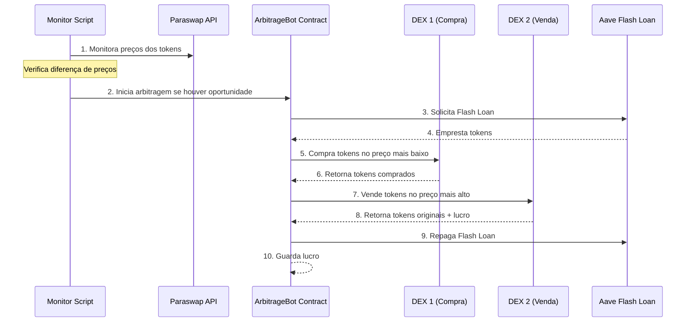

# Arquitetura do Sistema de Arbitragem

Este documento descreve a arquitetura e o fluxo de execução do sistema de arbitragem de tokens implementado.

## Diagrama de Sequência

## Componentes Principais

### 1. Monitor Script (monitor.py)

O script de monitoramento é responsável por:
- Monitorar continuamente 6 pares de tokens na rede Polygon
- Utilizar a API Paraswap para obter preços em diferentes DEXs
- Calcular diferenças de preço e identificar oportunidades de arbitragem

Melhorias planejadas:
- Substituir prints por logging estruturado (módulo logging)
- Configuração via variáveis de ambiente (.env)
- Métricas Prometheus/Grafana
- Paralelização de requisições com asyncio
- Notificações via Slack/Telegram
- Testes unitários e de integração

### 2. Contrato Inteligente (ArbitrageBot.sol)

O contrato inteligente é construído sobre:
- Base: FlashLoanReceiverBase do Aave
- DEXs integradas:
  - Quickswap (0xa5E0829CaCEd8fFDD4De3c43696c57F7D7A678ff)
  - Sushiswap (0x1b02dA8Cb0d097eB8D57A175b88c7D8b47997506)

Melhorias planejadas:
- Integração com OpenZeppelin:
  - ReentrancyGuard
  - SafeERC20
- Testes unitários Hardhat
- Auditoria com MythX/Slither

## Fluxo de Execução

### 1. Detecção de Oportunidade

O sistema monitora continuamente os preços:
- Verifica preços dos tokens em diferentes DEXs
- Calcula diferença percentual entre preços
- Considera custos operacionais:
  - Gas em USD
  - Taxas das DEXs
  - Taxa do flash loan
- Verifica se a diferença supera todos os custos

### 2. Execução da Arbitragem

Quando uma oportunidade lucrativa é detectada:

1. Solicitação de Flash Loan
   - Contrato solicita empréstimo ao Aave
   - Quantidade baseada na oportunidade identificada

2. Execução das Trocas
   - Compra tokens na DEX com preço mais baixo
   - Vende tokens na DEX com preço mais alto

3. Finalização
   - Repaga flash loan com os tokens recebidos
   - Armazena o lucro no contrato

### 3. Segurança e Controle

Mecanismos de segurança implementados:
- Restrição de acesso: apenas owner pode iniciar arbitragem
- Verificações de saldo antes/depois para confirmar lucro
- Sistema de eventos para registrar resultados
- Função de withdraw para retirada segura de lucros

Melhorias planejadas:
- Implementação ReentrancyGuard
- Uso de SafeERC20
- Análise estática de segurança
- Testes de cenários de ataque

### 4. Gestão de Erros

O sistema implementa diversos mecanismos de resiliência:
- Try/catch para operações críticas de troca
- Backoff exponencial nas requisições à API
- Eventos detalhados para monitoramento
- Verificações de slippage para proteção contra perdas

## Ambiente de Desenvolvimento

### Estrutura de Branches
- `main`: Código em produção
- `develop`: Branch principal de desenvolvimento
- `feature/*`: Branches para novas funcionalidades
- `hotfix/*`: Correções urgentes em produção

### CI/CD (GitHub Actions)
1. Build e Testes
   - Lint Solidity/Python
   - Testes unitários
   - Análise de segurança
   
2. Deploy
   - Staging (testnet)
   - Produção (mainnet)

### Testes

1. Contrato Solidity
   - Testes unitários (Hardhat)
   - Cenários de arbitragem
   - Falhas por slippage
   - Tentativas não autorizadas
   - Fork tests da mainnet

2. Monitor Python
   - Testes unitários
   - Mocks de API/Web3
   - Testes de integração
   - Backtesting com dados históricos

### Monitoramento

1. Logs
   - Formato JSON estruturado
   - Rotação de arquivos
   - Níveis: INFO, WARNING, ERROR
   - Campos: timestamp, evento, dados

2. Métricas
   - Oportunidades detectadas
   - Trades executados
   - Lucro/perda
   - Latência de API
   - Gas utilizado

3. Alertas
   - Spread acima do limiar
   - Falhas de execução
   - Custos de gas anormais
   - Latência elevada

## Considerações Técnicas

- Rede: Polygon (MATIC)
- Flash Loan Provider: Aave V3
- DEXs Suportadas: Quickswap, Sushiswap
- API de Preços: Paraswap
- Framework de Testes: Hardhat + Pytest
- CI/CD: GitHub Actions
- Monitoramento: Prometheus + Grafana
- Logging: structlog + JSON

## Pares de Tokens Monitorados

1. AAVE/USDC
2. WBTC/WETH
3. USDC/USDT
4. USDC/WETH
5. WETH/MATIC
6. DAI/USDC

Cada par é monitorado em ambas as direções para maximizar oportunidades de arbitragem.

## Próximos Passos

1. Implementação das melhorias de segurança
2. Setup do ambiente de CI/CD
3. Implementação do sistema de logging
4. Configuração do monitoramento
5. Desenvolvimento dos testes automatizados
6. Backtesting e simulação
7. Auditoria de segurança
8. Deploy em staging
9. Testes em mainnet